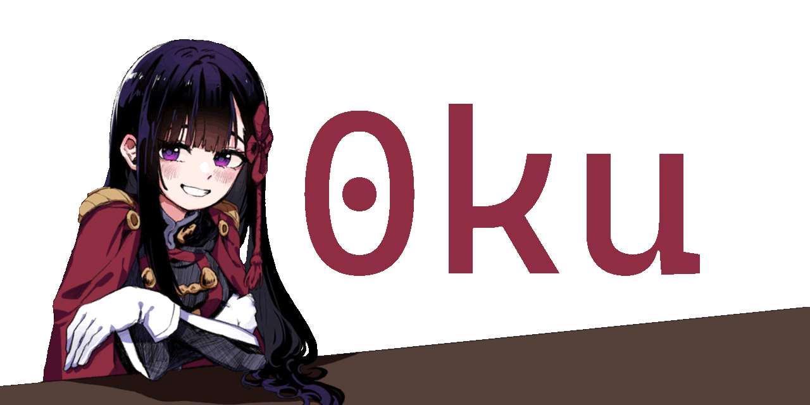

### Welcome!
I'm currently a student at the University of Waterloo studying Computer Engineering 1A.  
- 🔭 I’m currently working on [Geese Migration](https://github.com/Abdullah9340/Geese-Migration)
- 😄 Pronouns: he/him/they  
<!--
**0ku/0ku** is a ✨ _special_ ✨ repository because its `README.md` (this file) appears on your GitHub profile.

Here are some ideas to get you started:

- 🔭 I’m currently working on ...
- 🌱 I’m currently learning ...
- 👯 I’m looking to collaborate on ...
- 🤔 I’m looking for help with ...
- 💬 Ask me about ...
- 📫 How to reach me: ...
- 😄 Pronouns: ...
- ⚡ Fun fact: ...
-->
